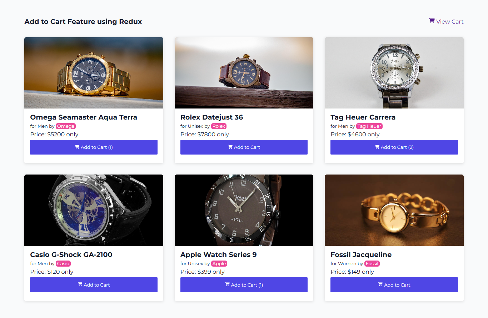
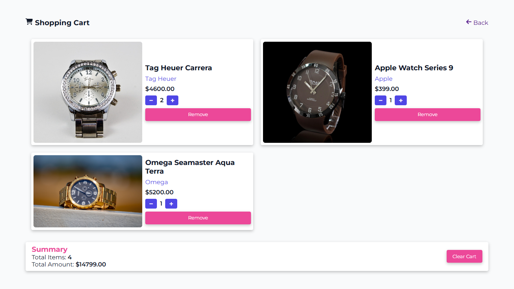

# 🛍️ Ecommerce Cart — React + Redux Toolkit

A modern **ecommerce cart application** built using **React** and **Redux Toolkit**. This project demonstrates a complete shopping cart feature — including product listing, add to cart, quantity management, and dynamic price calculations.

> 🔧 Built as a hands-on project to practice Redux Toolkit and React in a real-world scenario.


## 📸 Preview

  
 

---

## 🚀 Features

✅ Browse watch products on the Home Page  
✅ Add items to the cart  
✅ View and manage cart items  
✅ Update item quantities  
✅ Remove items from the cart  
✅ Auto-updated cart totals  
✅ Fully responsive layout  
✅ Clean and modular code using Redux Toolkit best practices  

---

## 🧱 Tech Stack

- **React** (Functional components + Hooks)
- **Redux Toolkit** (for state management)
- **React-Redux**
- **React Router DOM**
- **Vanilla CSS** (Responsive layout)

---

## 📂 Project Structure

```

ecommerce-cart-redux-toolkit/
│
├── public/                  # Public assets
├── src/
│   ├── assets/              # Product images and static assets
│   ├── cart/               # Route-based pages
│   │   ├── AddCard.jsx
│   │   ├── CartData.js
│   │   ├── cartSlice.js
│   │   ├── cartStyle.css
│   │   ├── Product.jsx
│   │   └── store.js
│   ├── App.jsx              # Main App component
│   ├── App.css              # Main App Style
│   └── index.jsx             # App entry point
│
├── .gitignore
├── README.md
└──package.json

````

---

## 📦 Getting Started

Follow these steps to run the project locally:

### 1. Clone the Repo

```bash
git clone [https://github.com/your-username/ecommerce-cart-redux-toolkit.git](https://github.com/bachansingh1407/ECommerce-Cart-Redux-Toolkit/)
cd client
````

### 2. Install Dependencies

```bash
npm install
```

### 3. Start the App

```bash
npm start
```

---

## 🧪 Core Functionality Overview

| Feature         | Description                                   |
| --------------- | --------------------------------------------- |
| Product Listing | Shows list of watches with image, name, price |
| Add to Cart     | Adds selected item to the cart                |
| Cart Page       | View all added items, quantities, and prices  |
| Update Quantity | Increase or decrease quantity per item        |
| Remove Item     | Delete item from cart                         |
| Price Summary   | Subtotal and total amount auto-calculated     |

---

## 🧑‍💻 About the Developer

**Bachan Singh** — Full Stack Developer
📄 [Portfolio Website](https://bachansingh.netlify.app)
📧 [Email](mailto:bachansingh@gmail.com)
🔗 [LinkedIn](https://www.linkedin.com/in/bachansingh)
🐱 [GitHub](https://github.com/bachansingh1407)

---

## 🙌 Acknowledgements

* [Redux Toolkit Documentation](https://redux-toolkit.js.org/)
* [React Official Docs](https://reactjs.org/)

---

## ⭐️ Show Some Love

If you liked this project, feel free to give it a **⭐️ star** on GitHub! It helps more people find and learn from it.

---
